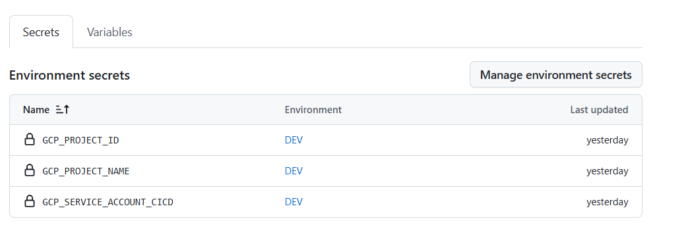
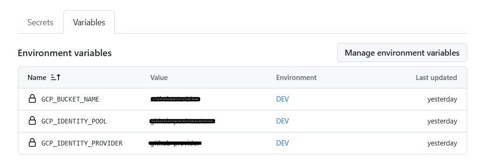
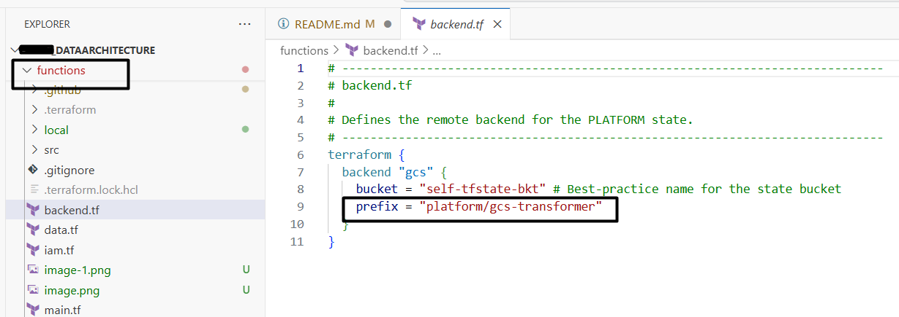

# Repositorio de Cloud Functions - Plataforma de Datos

Este repositorio contiene el código fuente (Python) y la infraestructura como código (Terraform) para desplegar funciones serverless en la plataforma de datos. El enfoque principal es la ingesta y transformación de datos de manera event-driven.

Este proyecto utiliza un único conjunto de archivos de Terraform para empaquetar y desplegar una función específica. El despliegue se activa automáticamente cuando se detectan cambios en el código fuente de la función a través de un **hash de contenido**, asegurando que solo se realicen actualizaciones cuando sea necesario para máxima eficiencia.

## Arquitectura

La gestión de la infraestructura está dividida en dos repositorios para seguir el principio de separación de responsabilidades, lo cual es una práctica recomendada para equipos de datos modernos.

1.  **Repositorio de Plataforma (`self-data-platform`):**
    * **Qué hace:** Gestiona la infraestructura base y compartida (VPC, buckets de GCS, datasets de BigQuery, Composer, cuentas de servicio para CI/CD, etc.).
    * **Por qué:** Centraliza la gestión de los recursos fundamentales, asegurando consistencia y seguridad. El equipo de plataforma garantiza que los cimientos sean estables.
    * **Quién lo gestiona:** El equipo de plataforma o DevOps.

2.  **Este Repositorio (`self-data-platform-functions`):**
    * **Qué hace:** Contiene la lógica de negocio de cada función (código Python) y la infraestructura específica para desplegar esa función.
    * **Por qué:** Permite a los equipos de desarrollo de datos trabajar de forma autónoma. Pueden desplegar y actualizar sus aplicaciones sin necesidad de modificar la infraestructura central.
    * **Cómo se conecta:** Utiliza un `data source` de Terraform para leer de forma segura los outputs (como nombres de buckets) del estado del repositorio de plataforma.
    * **Quién lo gestiona:** Los equipos de ingeniería de datos o desarrolladores de aplicaciones.

## Estructura del Repositorio

El repositorio está organizado para mantener una clara separación entre la infraestructura (Terraform) en la raíz y el código fuente de la aplicación (Python) en el directorio `src`.

```
.
├── .github/
│   └── workflows/
│       └── deploy.yml      # Workflow de CI/CD para despliegue automático
│
├── src/
│   └── load_landing_to_raw/
│       ├── main.py         # Código fuente de la función
│       └── requirements.txt# Dependencias de Python para esta función
│
├── .gitignore              # Archivos y carpetas a ignorar por Git
├── backend.tf              # Configuración del backend remoto de Terraform
├── data.tf                 # Data sources para leer del estado de la plataforma
├── iam.tf                  # Permisos IAM específicos para la función
├── main.tf                 # Recurso principal de la Cloud Function
└── ... (otros archivos .tf en la raíz)
```

---

## Configuración de CI/CD (GitHub Actions)

Para que el pipeline de despliegue (`deploy.yml`) funcione, es necesario configurar un **Entorno** en GitHub llamado `DEV` con los siguientes secretos y variables. El uso de entornos permite proteger los despliegues y gestionar configuraciones para diferentes ambientes (ej. `DEV`, `PROD`).

**Ubicación:** En tu repositorio de GitHub, ve a **Settings > Environments > New environment** y nómbralo `DEV`.

### 1. Secretos del Entorno (`secrets`)



Los secretos son para información sensible que no debe ser visible en los logs.

| Nombre del Secreto              | Descripción                                                                 | Cómo Obtener el Valor                                                                                             |
| ------------------------------- | --------------------------------------------------------------------------- | ----------------------------------------------------------------------------------------------------------------- |
| `GCP_PROJECT_ID`                | El ID de tu proyecto de Google Cloud (ej. `you-project-id`).       | Es el ID de tu proyecto de GCP.                                                                                   |
| `GCP_PROJECT_NAME`              | El ID de tu proyecto de Google Cloud (usado en los `-var` de Terraform).      | Usualmente es el mismo valor que `GCP_PROJECT_ID`.                                                                |
| `GCP_SERVICE_ACCOUNT_CICD`      | El email de la cuenta de servicio que usará el CI/CD para desplegar.          | Ejecuta `terraform output -raw cicd_service_account_email` en tu repositorio de **plataforma** (github_actions_sa lo encuentra en terraform o su email va ser de este formato github-actions-cicd@<your-project-id>.iam.gserviceaccount.com).                     |

### 2. Variables del Entorno (`vars`)



Las variables son para configuración no sensible.

| Nombre de la Variable     | Descripción                                                                 | Cómo Obtener el Valor                                                                                             |
| ------------------------- | --------------------------------------------------------------------------- | ----------------------------------------------------------------------------------------------------------------- |
| `GCP_IDENTITY_POOL`       | El nombre corto del Workload Identity Pool.                                 | `github-pool` (el nombre que le dimos en el Terraform de la plataforma).                                          |
| `GCP_IDENTITY_PROVIDER`   | El nombre corto del proveedor dentro del pool.                              | `github-provider` (el nombre que le dimos en el Terraform de la plataforma).                                      |
| `GCP_BUCKET_NAME`         | El nombre del bucket donde se guarda el estado de Terraform.                | `self-tfstate-bkt` (el nombre del bucket que creaste manualmente).                                                |

---

## Despliegue Manual (Para Desarrollo y Pruebas)

Si necesitas desplegar la función manualmente desde tu máquina local, sigue estos pasos.

### Prerrequisitos (Configuración Única)

1.  **Crear el Bucket de Backend (Paso deprecado, creado en las indicaciones de el repositorio self-data-platform ):** Terraform necesita un bucket en GCS para almacenar su archivo de estado. Este bucket debe ser creado manualmente una sola vez.
    ```bash
    # Reemplaza 'tu-gcp-project-id-aqui' con tu Project ID
    gcloud storage buckets create gs://self-tfstate-bkt --project=tu-gcp-project-id-aqui --location=us-central1 --uniform-bucket-level-access
    ```

Si bien este paso es deprecado, es importante mencionar que ambos repositorios deben tener el mismo bucket de estado para evitar inconsistencias, pero tienen distinto prefix en el nombre del bucket.




2.  **Autenticación Local:** Asegúrate de que tu SDK de gcloud esté autenticado con una cuenta que tenga los permisos necesarios para desplegar.
    ```bash
    gcloud auth application-default login
    ```
3.  **Crear archivo `terraform.tfvars`:** Para evitar pasar variables por la línea de comandos, crea un archivo `terraform.tfvars` en la raíz del proyecto. **Este archivo no debe ser subido a Git.**
    ```terraform
    # terraform.tfvars
    gcp_project_id      = "tu-gcp-project-id-aqui"
    gcp_region          = "us-central1"
    function_source_dir = "src/load_landing_to_raw"
    ```

### Pasos para el Despliegue

Una vez completada la configuración, el despliegue es estándar.

1.  **Inicializar Terraform:** Navega a la raíz del repositorio y ejecuta `init`. Esto descargará los proveedores y configurará el backend remoto.
    ```bash
    terraform init
    ```
2.  **Planificar y Aplicar:** Revisa los cambios que Terraform va a realizar y, si estás de acuerdo, aplícalos.
    ```bash
    terraform plan
    terraform apply
    

### Alternativa: Usar Estado Local (Sin Backend Remoto)

Si estás trabajando solo en un entorno de prueba y no quieres configurar un bucket de backend remoto, puedes usar el estado local de Terraform.

**Advertencia:** Este método no es recomendado para trabajo en equipo o entornos de producción, ya que el estado no se comparte ni se bloquea, lo que puede llevar a conflictos y corrupción del estado.

1.  **Eliminar la Configuración del Backend:** Elimina o renombra el archivo `backend.tf`.
2.  **Actualizar `.gitignore`:** Es **crucial** que no subas tu archivo de estado local a Git. Añade las siguientes líneas a tu archivo `.gitignore`:
    ```
    # Terraform local state files
    terraform.tfstate
    terraform.tfstate.backup
    ```
3.  **Inicializar Terraform:** Ahora, cuando ejecutes `init`, Terraform no te preguntará por la configuración del backend y creará un archivo `terraform.tfstate` en tu directorio local.
    ```bash
    terraform init
    ```
4.  **Continuar con el Despliegue:** Los comandos `terraform plan` y `terraform apply` funcionarán de la misma manera, pero leerán y escribirán en tu archivo de estado local.
